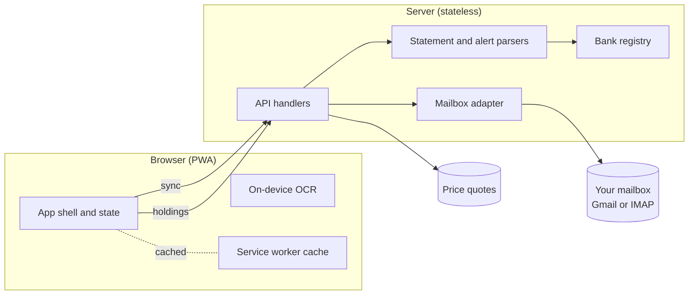

<p align="center">
  
</p>

<h1 align="center">Crumina</h1>

<p align="center">Your money, all in one place, without handing it to anyone.</p>

<p align="center">
  <a href="LICENSE"></a>
  
  
  
  
</p>

---

Crumina is a personal-finance web app you run yourself. It reads your own bank
statements and transaction alerts from your mailbox, turns them into one view of
your accounts, spending and net worth, and keeps the data on your side. There is no
shared ledger and no third-party analytics. Sign in with Google, connect any mailbox
over IMAP, or skip accounts entirely and keep everything on one device.

It installs as a Progressive Web App, works offline once it has synced, and is
available in English and Bahasa Indonesia.

> **Status:** beta. The parsing covers a set of bank layouts out of the box and falls
> back to generic patterns for the rest; see [Supported statements](#supported-statements).

## Contents

- [Features](#features)
- [How it works](#how-it-works)
- [Quick start](#quick-start)
- [Configuration](#configuration)
- [Supported statements](#supported-statements)
- [Project structure](#project-structure)
- [Tech stack](#tech-stack)
- [Documentation](#documentation)
- [Security and privacy](#security-and-privacy)
- [Contributing](#contributing)
- [License](#license)

## Features

- **Reads your mailbox, read-only.** Connects to Gmail through OAuth or to any server
  over IMAP, and never sends, deletes or changes mail.
- **Parses monthly statements.** Extracts balances and transaction rows from PDF
  e-statements, and unlocks password-protected PDFs with a per-bank password you enter.
- **Captures real-time alerts.** Turns bank and card notification emails into
  transactions as they arrive, with a heuristic parser for senders it does not know.
- **Reconciles the two sources.** Matches alerts against the monthly statement, pairs
  transfers between your own accounts, and treats a card bill payment as settlement
  rather than spending, so the same money is not counted twice.
- **Shows one net worth.** Rolls up savings, cards, securities cash and a manually
  tracked investment portfolio, with live prices for holdings.
- **Explains spending.** Cleans and categorises transactions, shows a "Where it goes"
  breakdown and an Insights view over a date range you choose, plus a rough carbon
  estimate of your spending.
- **Reads receipts on the device.** Optional OCR runs in the browser with a bundled
  Tesseract build; the photo never leaves your machine.
- **Runs without an account.** Local mode keeps everything in the browser, useful for
  trying it or for a single device.
- **Installs and works offline.** A service worker caches the app shell so it opens
  without a connection and syncs again when one returns.
- **Speaks two languages.** English and Bahasa Indonesia, switchable in settings.

## How it works

The browser holds the app and most of the state. The server is a thin layer that
reads your mailbox, decrypts statement PDFs and signs you in. It does not keep a copy
of your finances; parsed results are returned to the browser and not stored.



Anything specific to a bank lives in one file, [`app/lib/banks.js`](app/lib/banks.js):
the email senders to look for, statement password slots, balance patterns, and the
domain-to-name map for alerts. The parsing engines stay generic and read from that
registry, so a new institution is an edit to one file. For the full picture, read
[docs/ARCHITECTURE.md](docs/ARCHITECTURE.md).

## Quick start

You need Node 18 or newer. The client has no build step, so there is nothing to
compile.

```bash
git clone https://github.com/your-org/crumina.git
cd crumina/app
npm ci --omit=dev          # installs the PDF and IMAP libraries

cd ../selfhost
cp .env.example .env        # set SESSION_SECRET and TOKEN_ENC_KEY at minimum
node server.js              # serves the whole app on http://localhost:3000
```

Open `http://localhost:3000` and choose **Use locally** to try it with no accounts,
or connect a mailbox. Generate the two secrets with:

```bash
openssl rand -base64 48     # SESSION_SECRET
openssl rand -base64 32     # TOKEN_ENC_KEY
```

To run it in a container instead, with automatic HTTPS through Caddy:

```bash
cd selfhost
cp .env.example .env
docker compose up -d --build
```

The full deployment guide, including systemd and any-platform notes, is in
[docs/SELF-HOSTING.md](docs/SELF-HOSTING.md).

## Configuration

Configuration comes entirely from environment variables; nothing is hard-coded. The
two required values are `SESSION_SECRET` (signs the session cookie) and
`TOKEN_ENC_KEY` (a 32-byte base64 key that encrypts stored secrets). Google sign-in
and IMAP are optional and activate only when their variables are set.

| Variable | Required | Purpose |
|---|---|---|
| `SESSION_SECRET` | yes | Signs the session cookie (HMAC-SHA256) |
| `TOKEN_ENC_KEY` | yes | AES-256-GCM key for tokens, credentials and statement passwords |
| `GOOGLE_CLIENT_ID` / `GOOGLE_CLIENT_SECRET` / `GOOGLE_REDIRECT_URI` | no | Enable Google sign-in |
| `IMAP_ENABLED` | no | Show the IMAP sign-in option (self-host) |
| `PORT` | no | Port for the self-host server (default 3000) |

Before running a public instance, replace the placeholder domain, contact email and
repository link noted in [docs/CONFIGURATION.md](docs/CONFIGURATION.md).

## Supported statements

Out of the box, Crumina recognises a handful of statement and alert layouts defined in
the bank registry, and falls back to generic patterns ("closing balance", "amount
due", and similar) for everything else. Captured amounts are read with a parser that
handles both `1,234,567.89` and `1.234.567` number styles, so currency formatting does
not trip it up.

Adding an institution means appending one entry to `app/lib/banks.js`: the sender
address, a password slot if the PDF is protected, and one or more balance patterns. No
change to the parsing engine is needed. The format and a worked example are in
[docs/BANK-PARSERS.md](docs/BANK-PARSERS.md).

## Project structure

```
app/                 the deployable web app
  index.html app.js  client (vanilla JS, no framework, no build)
  api/               request handlers, one file per endpoint
  lib/               session, crypto, mailbox, parsing, rate limiting
  lib/banks.js       institution registry (the only bank-specific file)
  vendor/tesseract/  on-device OCR assets
  brand/             logos and icons
selfhost/            server.js, Dockerfile, compose, Caddy, systemd unit
docs/                architecture, configuration, self-hosting, security, API
brand/               logo and icon assets
```

## Tech stack

The client is vanilla HTML, CSS and JavaScript with no framework and no bundler. The
server is plain Node: serverless-style `(req, res)` handlers that also run behind a
small built-in HTTP server for self-hosting. PDF text extraction uses `pdfjs-dist`,
IMAP uses `imapflow` and `mailparser`, and receipt OCR uses a bundled build of
Tesseract that runs in the browser. State persists in the browser; the server keeps no
transaction database.

## Documentation

| Document | What it covers |
|---|---|
| [Architecture](docs/ARCHITECTURE.md) | Components, data flow, request lifecycle |
| [Configuration](docs/CONFIGURATION.md) | Environment variables and options |
| [Self-hosting](docs/SELF-HOSTING.md) | Running your own instance, with or without Docker |
| [Bank parsers](docs/BANK-PARSERS.md) | Adding or changing a supported institution |
| [API reference](docs/API.md) | Endpoints and their contracts |
| [Security](docs/SECURITY.md) | Threat model, cryptography, disclosure |
| [Contributing](CONTRIBUTING.md) | Development setup and conventions |

## Security and privacy

Crumina asks for read-only mailbox access and never writes to your
mailbox. Google refresh tokens, IMAP credentials and statement passwords are encrypted at
rest with AES-256-GCM; sessions are signed, `HttpOnly` cookies. The server applies a
strict Content-Security-Policy and keeps no record of your transactions. The full
threat model and the steps for reporting a vulnerability are in
[docs/SECURITY.md](docs/SECURITY.md).

## Contributing

Contributions are welcome. The project stays small and dependency-light on purpose, so
read [CONTRIBUTING.md](CONTRIBUTING.md) for the conventions (the client/server split,
the bank registry, the security rules) before opening a pull request.

## License

Crumina is released under the GNU Affero General Public License v3.0
([LICENSE](LICENSE)). The AGPL's network clause is the part that matters here: if you
run a modified copy as a service that others can reach, you must offer those users the
source of your modified version. The repository link in `app/app.js` is how they reach
it, so point it at your own source when you deploy.
