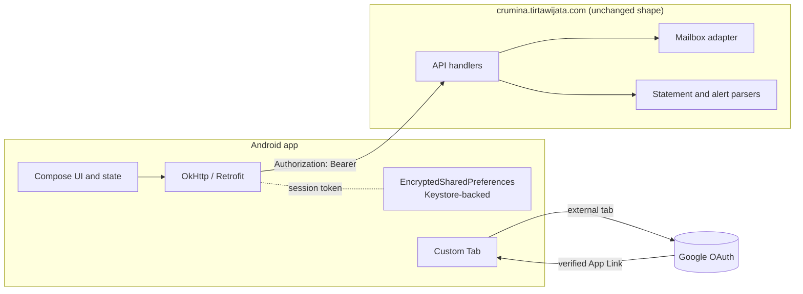
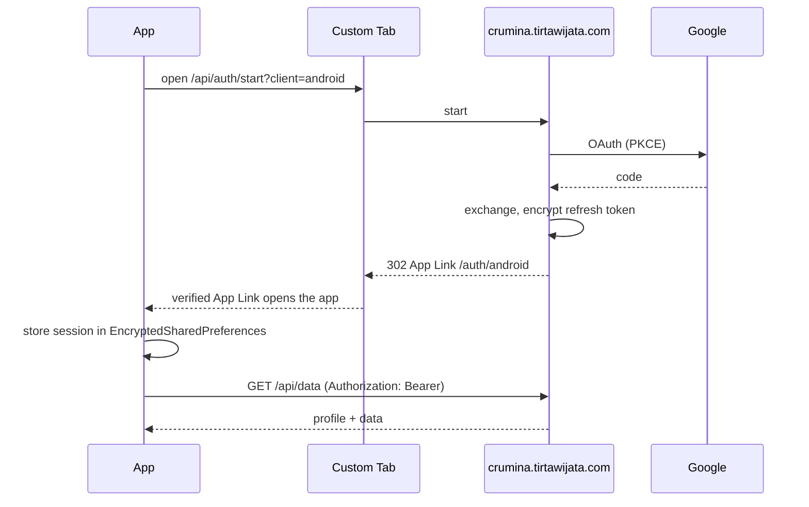

# Crumina on Android

This document covers how Crumina ships as a native Android app: the architecture, the
authentication redesign, the Google security controls, the backend changes it needs, and
how the signed APK is built in CI.

## Decision and trade-off

The Android client is a **native Kotlin / Jetpack Compose app**, not a Trusted Web
Activity or a WebView wrapper. A native app gives platform-native UX, biometric app
lock, Play Integrity attestation and Keystore-backed credential storage. The cost is
real: the UI that the PWA already implements is re-written natively, so the two clients
no longer share one codebase. The **server is unchanged in shape**: the app is a new
client of the same JSON API, so all parsing, sync, FX and quote logic stays on the
server and is reused as-is.

The app talks to one origin only, `https://crumina.tirtawijata.com`, over TLS. The only
third party it touches is Google sign-in, and that happens in an external browser tab,
never inside the app.

## Architecture at a glance



The phone holds the UI, app state and the user's session token. The server still does
the privileged work (reads the mailbox, decrypts statements, signs the user in) and
keeps no copy of the user's finances.

## Authentication (the real re-architecture)

The web app signs in with Google OAuth and the server sets `HttpOnly` cookies. A native
app cannot use those cookies, and **Google's policy forbids running OAuth inside an
embedded WebView**. So native auth is redesigned around three pieces: an external
user-agent, a verified App Link, and a server that hands the app a bearer token.

### Flow

1. The app opens a **Chrome Custom Tab** to `GET /api/auth/start?client=android`.
   (Custom Tabs are the Google-sanctioned external user-agent; they share the system
   browser's session and are not controllable by the app.)
2. The server runs the existing Google OAuth exchange, gets the user's profile and an
   encrypted refresh token, exactly as it does for web.
3. Instead of setting cookies, the server returns a **302 to a verified App Link**:
   `https://crumina.tirtawijata.com/auth/android#t=<session>&p=<profile>&rt=<enc_refresh>`
   The payload rides in the URL **fragment** (after `#`), which browsers never send to a
   server and never log.
4. Android opens the **app directly** because the app declares an intent filter for that
   HTTPS path and the path is **verified by Digital Asset Links** (the same
   `assetlinks.json` mechanism as a TWA, keyed to the app's signing certificate). No
   browser, no other app, can intercept the redirect.
5. The app reads the fragment, stores the session in **EncryptedSharedPreferences**, and
   from then on sends `Authorization: Bearer <session>` on every API call.



### Where the Gmail refresh token lives

The server is stateless (no database), so it cannot park the Gmail refresh token
server-side keyed to a session. Two options:

- **Default (no new infrastructure).** The app holds the *encrypted* refresh token
  (Keystore-backed at rest) and returns it on sync via an `X-Cr-Rt` header; the server
  decrypts it with `TOKEN_ENC_KEY` and uses it just like the cookie value today. The
  token is never in plaintext at rest or in logs.
- **Recommended before a public release.** Add a KV store (already on the deployment
  roadmap) so refresh tokens stay server-side keyed to the session; the app then only
  ever holds the opaque session bearer. Prefer this once a KV is available.

Guest/local mode and IMAP sign-in map onto the same model: the app calls `/api/guest`
for a local session, and IMAP credentials use the existing encrypted path.

## Google security controls the app enforces

| Area | Control |
|---|---|
| OAuth | External user-agent (Chrome Custom Tabs), never an embedded WebView, as required by Google's secure-browser policy |
| Redirect integrity | App Links verified by Digital Asset Links (`assetlinks.json`); the redirect cannot be hijacked by another app |
| Token storage | AndroidX Security `EncryptedSharedPreferences` with a master key in the Android Keystore (StrongBox when present); no tokens in plaintext, logs or cloud backups |
| Backups | `android:allowBackup="false"` and `dataExtractionRules` exclude the credential store |
| Screen privacy | `FLAG_SECURE` on screens that show balances, blocking screenshots and the recents thumbnail |
| Transport | `network_security_config.xml`: `cleartextTrafficPermitted="false"`, scoped to `crumina.tirtawijata.com`; optional certificate pinning (documented, off by default so a cert rotation can't brick installs) |
| Permissions | `INTERNET` only; `CAMERA` only if on-device receipt OCR is ported, and then runtime-requested |
| Release hardening | R8 minify + resource shrink; Logcat stripped of any PII/token output in release builds |
| App signing | Play App Signing (Google holds the app signing key; you hold only the upload key) |
| Attestation | Play Integrity API to confirm a genuine app/device before privileged calls |
| Dependencies | Pinned versions, maintained libraries only (AndroidX Browser/Custom Tabs, AndroidX Security, Retrofit/OkHttp) |

## Backend changes this depends on

All changes fold into **existing** handlers so the deployment stays under the Vercel
Hobby 12-function limit. No new `api/*.js` files.

- **Done (`app/lib/session.js`).** `fromReq` now also reads `Authorization: Bearer`
  (additive; the web cookie path is unchanged). This is what lets the app authenticate
  every API call.
- **To apply (`app/lib/mailbox.js`, `getMailbox`).** Read the encrypted refresh token
  from an `x-cr-rt` header as a fallback to the `tally_rt` cookie:

  ```js
  var rt = getCookie(req,'tally_rt') || (req.headers && req.headers['x-cr-rt']);
  ```

- **To apply (`app/api/auth/start.js`).** Accept `?client=android` and carry it inside
  the OAuth `state` so the callback knows the caller is the app.
- **To apply (`app/api/auth/callback.js`).** When the state marks an android client,
  302 to the App Link with the session/profile/encrypted-refresh in the fragment instead
  of setting cookies:

  ```js
  if (isAndroid) {
    const frag = 't='+encodeURIComponent(sign(email))
               + '&p='+encodeURIComponent(prof)
               + '&rt='+encodeURIComponent(encrypt(refresh_token));
    res.writeHead(302, { Location: 'https://crumina.tirtawijata.com/auth/android#'+frag });
    return res.end();
  }
  ```

- **To host:** `/.well-known/assetlinks.json` on `crumina.tirtawijata.com`, containing
  the app's package name and the **release signing SHA-256**. This verifies both the App
  Link redirect and (if later wrapped) any TWA. Example:

  ```json
  [{
    "relation": ["delegate_permission/common.handle_all_urls"],
    "target": { "namespace": "android_app",
      "package_name": "id.tirtawijata.crumina",
      "sha256_cert_fingerprints": ["<RELEASE_SHA256>"] }
  }]
  ```

## Project structure

```
android/
  settings.gradle.kts
  build.gradle.kts                  root build config + plugin versions
  gradle.properties
  gradle/wrapper/                   pinned Gradle wrapper
  app/
    build.gradle.kts                deps, signing config (reads CI secrets/env)
    proguard-rules.pro
    src/main/AndroidManifest.xml    minimal perms, App Link intent filter
    src/main/res/xml/network_security_config.xml
    src/main/java/id/tirtawijata/crumina/
      CruminaApp.kt
      MainActivity.kt
      data/SecureStore.kt           EncryptedSharedPreferences (Keystore)
      data/Api.kt                   Retrofit interface for crumina.tirtawijata.com
      data/Net.kt                   OkHttp with Bearer interceptor
      auth/AuthManager.kt           Custom Tab launch + App Link callback
      ui/OverviewScreen.kt          net worth / cash / investments
      ui/Theme.kt
```

## Build and signing (GitHub Actions)

CI is the build path: the workflow sets up **JDK 17** and the **Android SDK**, runs
`./gradlew assembleDebug` to validate that it compiles, then builds a **signed release
APK** from secrets and uploads it as a run artifact.

Required repository secrets:

| Secret | What it is |
|---|---|
| `ANDROID_KEYSTORE_BASE64` | your release keystore, base64-encoded |
| `ANDROID_KEYSTORE_PASSWORD` | keystore password |
| `ANDROID_KEY_ALIAS` | key alias |
| `ANDROID_KEY_PASSWORD` | key password |

Generate the keystore once, on your own machine, and keep it safe (losing it means you
cannot update the app):

```bash
keytool -genkeypair -v -keystore crumina-release.jks \
  -alias crumina -keyalg RSA -keysize 4096 -validity 10000
base64 -w0 crumina-release.jks   # paste into the ANDROID_KEYSTORE_BASE64 secret
```

Get the SHA-256 fingerprint for `assetlinks.json` (or copy it from Play Console → App
signing once the app is uploaded):

```bash
keytool -list -v -keystore crumina-release.jks -alias crumina | grep SHA256
```

CI decodes the keystore from the secret into a temporary file at build time and deletes
it afterward; the keystore is never committed.

## Distribution

- **Sideload APK.** Take the signed `app-release.apk` from the CI run and install it
  (the device must allow installing from unknown sources). Good for personal use and
  testing.
- **Google Play.** Switch the release step to `bundleRelease` (an `.aab`), enable Play
  App Signing, and upload to the Play Console. Add the Play Integrity API for device
  attestation. Play requires a privacy policy (already at `/privacy`) and a data-safety
  declaration: read-only mailbox access, finances stored on device/your server, no
  third-party analytics.

## Deploying crumina.tirtawijata.com

The native app points at `https://crumina.tirtawijata.com`, so that origin must serve the
existing `app/` (same code as the web deploy) with these set:

- **Env vars:** `SESSION_SECRET`, `TOKEN_ENC_KEY`, `GOOGLE_CLIENT_ID`, `GOOGLE_CLIENT_SECRET`,
  and `GOOGLE_REDIRECT_URI=https://crumina.tirtawijata.com/api/auth/callback`.
- **Google console:** add `https://crumina.tirtawijata.com/api/auth/callback` to the
  OAuth client's authorized redirect URIs.
- **Asset Links:** `app/.well-known/assetlinks.json` is served at
  `/.well-known/assetlinks.json`. Replace `REPLACE_WITH_RELEASE_SHA256` with your release
  signing SHA-256 (`keytool -list -v -keystore crumina-release.jks -alias crumina | grep SHA256`,
  or copy it from Play Console -> App signing). Until this matches, App Link verification
  fails and sign-in falls back to the browser page at `app/auth/android.html`.
- **Verify:** after deploy, `curl https://crumina.tirtawijata.com/.well-known/assetlinks.json`
  should return the JSON, and Android verifies the link on install.

## Scope: foundation vs. next

This draft delivers the **secure foundation**: the auth redesign, Keystore-backed token
storage, the network layer, an Overview screen (net worth, cash, investments) reading
`/api/data` and `/api/fx`, and the CI + signing pipeline. The remaining screens
(Accounts, Activity, Insights, Budgets, Portfolio, Settings), plus on-device OCR, an
offline cache, and full EN/ID parity, are incremental work on top of this skeleton.
